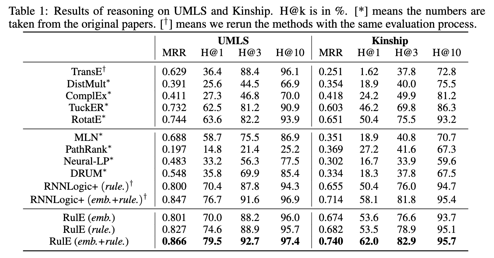
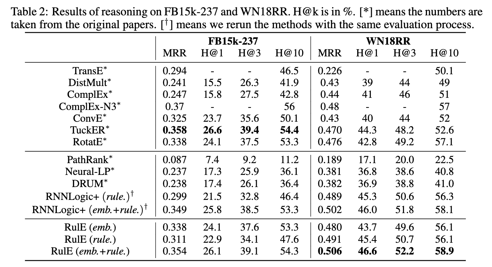
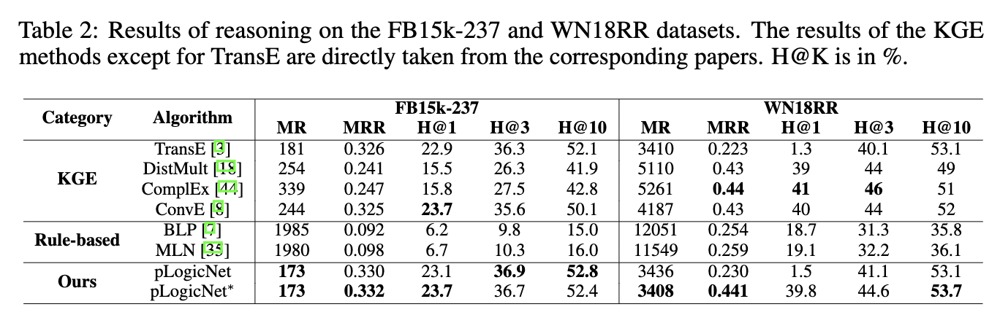
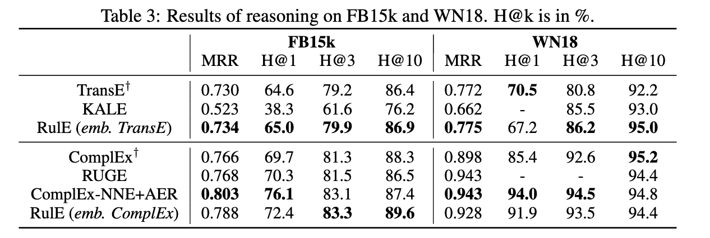
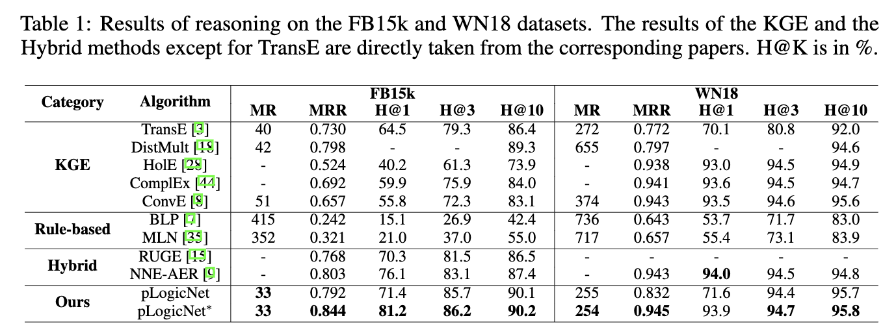

We collect a curated list of papers related to **Rule Injection** for Knowlegde Graph Embedding (KGE) models.

Papers are organized into the following categories:

- [Capability of modeling rule patterns](##Capability of modeling rule patterns)
- [Techniques of Rule injection](##Techniques of Rule injection)
- [Rule Mining](##Rule Mining)

We also extrat some valuable data from these paper for easy reference, including

-   [KGE models' Capacity of rule pattern learning](##KGE models' Capacity of rule pattern learning)
-   [Comparison of KGE inference performance](##Comparison of KGE inference performance)

## Capability of modeling rule patterns

| Year | Source   | Model                                                        | Other resources                                              |
| ---- | -------- | ------------------------------------------------------------ | ------------------------------------------------------------ |
| 2021 | WWW      | [MQuadE](https://dl.acm.org/doi/10.1145/3442381.3449879)     | [video](https://www.youtube.com/watch?v=vaoGxiog5Ag)         |
| 2021 | TPAMI    | [LogicENN](https://arxiv.org/abs/1908.07141)                 |                                                              |
| 2020 | NeuraIPS | [BoxE](https://arxiv.org/abs/2007.06267)                     | [code](https://github.com/ralphabb/BoxE) \| [video](https://papertalk.org/papertalks/9177) |
| 2019 | ICLR     | [RotatE](https://openreview.net/pdf?id=HkgEQnRqYQ)           | [code](https://github.com/DeepGraphLearning/KnowledgeGraphEmbedding) \| [blog](https://longaspire.github.io/blog/图谱论文笔记3/) |
| 2016 | AAAI     | [HolE](https://paperswithcode.com/paper/holographic-embeddings-of-knowledge-graphs) | [code](https://github.com/mnick/holographic-embeddings)      |
| 2015 | AAAI     | [TransR](https://linyankai.github.io/publications/aaai2015_transr.pdf) | [code](https://github.com/thunlp/TensorFlow-TransX)          |
| 2015 | ICLR     | [DistMult](https://scottyih.org/files/ICLR2015_updated.pdf)  |                                                              |
| 2014 | AAAI     | [TransH](https://ojs.aaai.org/index.php/AAAI/article/view/8870) | [code](https://github.com/thunlp/TensorFlow-TransX)          |
| 2013 | NeuraIPS | [TransE](https://proceedings.neurips.cc/paper/2013/file/1cecc7a77928ca8133fa24680a88d2f9-Paper.pdf) |                                                              |

## Techniques of Rule injection

| Year | Source   | Model                                          | Other resources                                              |
| ---- | -------- | ---------------------------------------------- | ------------------------------------------------------------ |
| 2022 | arxiv    | [RulE](https://arxiv.org/abs/2210.14905)       | [code](https://github.com/xiaojuantang/rule)                 |
| 2021 | ICLR     | [RNNLogic](https://arxiv.org/abs/2010.04029)   | [code](https://github.com/DeepGraphLearning/RNNLogic) \| [video](https://www.bilibili.com/video/BV1xe4y1e7bm/?spm_id_from=333.999.0.0&vd_source=42e3f601818dbf67242ca75d8b90b89b) |
| 2021 | TPAMI    | [LogicENN](https://arxiv.org/abs/1908.07141)   |                                                              |
| 2020 | ICLR     | [ExpressGNN](https://arxiv.org/abs/2001.11850) | [code](https://github.com/expressGNN/ExpressGNN)             |
| 2019 | NeuraIPS | [pLogicNet](https://arxiv.org/abs/1906.08495)  | [code](https://github.com/DeepGraphLearning/pLogicNet) \| [video](https://www.bilibili.com/video/BV1xe4y1e7bm/?spm_id_from=333.999.0.0&vd_source=42e3f601818dbf67242ca75d8b90b89b) |
| 2018 | AAAI     | [RUGE](https://arxiv.org/abs/1711.11231)       | [code](https://github.com/iieir-km/RUGE)                     |
| 2016 | EMNLP    | [KALE](https://aclanthology.org/D16-1019.pdf)  | [code](https://github.com/iieir-km/KALE)                     |

## Rule Mining

| Year | Source   | Model                                                        | Other resources                                              |
| ---- | -------- | ------------------------------------------------------------ | ------------------------------------------------------------ |
| 2021 | ICLR     | [RNNLogic](https://arxiv.org/abs/2010.04029)                 | [code](https://github.com/DeepGraphLearning/RNNLogic) \| [video](https://www.bilibili.com/video/BV1xe4y1e7bm/?spm_id_from=333.999.0.0&vd_source=42e3f601818dbf67242ca75d8b90b89b) |
| 2020 | ESWC     | [AMIE 3](https://link.springer.com/chapter/10.1007/978-3-030-49461-2_3) | [code](https://github.com/dig-team/amie)                     |
| 2019 | NeuraIPS | [DRUM](https://arxiv.org/abs/1911.00055)                     | [code](https://github.com/alisadeghian/DRUM)                 |
| 2017 | NIPS     | [NeuraLP](https://proceedings.neurips.cc/paper/2017/hash/0e55666a4ad822e0e34299df3591d979-Abstract.html) | [code](https://github.com/fanyangxyz/Neural-LP)              |

---

## KGE models' Capacity of rule pattern learning

## Comparison of KGE inference performance

### 1. Link Prediction | @UMLS @Kinship

>   Source: [RulE (table 1)](https://arxiv.org/abs/2210.14905)

### 2. Link Prediction | @FB15K237 @WN18RR

>   Source: [RulE (table 2)](https://arxiv.org/abs/2210.14905), [pLogicNet (table2)](https://click.endnote.com/viewer?doi=10.48550%2Farxiv.1906.08495&token=WzEyMTEwMDYsIjEwLjQ4NTUwL2FyeGl2LjE5MDYuMDg0OTUiXQ.HKarNnTAz0YklU-MJ8g_QOHrDn4)

### 3. Link Prediction | @FB15K @WN18

>   Source: [RulE (table 3)](https://arxiv.org/abs/2210.14905), [pLogicNet (table1)](https://click.endnote.com/viewer?doi=10.48550%2Farxiv.1906.08495&token=WzEyMTEwMDYsIjEwLjQ4NTUwL2FyeGl2LjE5MDYuMDg0OTUiXQ.HKarNnTAz0YklU-MJ8g_QOHrDn4)

